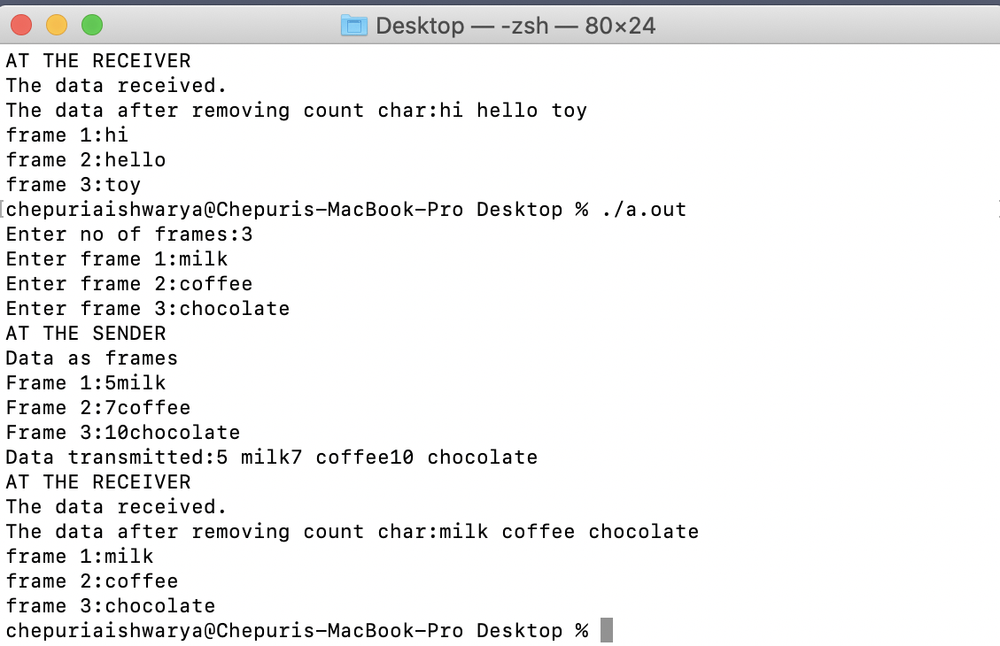

# Experiment 1

## Aim of Experiment
To impliment data link layer framing i.e character count 
 
### Procedure
1.Intially take the input 1.No of frames 2.Take each frame details
2.Now add header to each of the frame and print each frame with the header at sender side and transmit the data to reciever after adding the header
3.After that remove the headers and print data at the reciever side and the data in each frame

